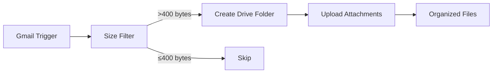

# Gmail Drive Organizer


Automated email attachment management that monitors Gmail, filters messages by size, and organizes attachments into structured Google Drive folders with smart naming conventions.

## Overview

This n8n workflow eliminates manual attachment organization by automatically monitoring your Gmail inbox, filtering emails with attachments above a size threshold, creating organized Drive folders named with email subject and timestamp, and uploading all attachments to the appropriate folder.

### Workflow Diagram



## Key Features

- **Gmail Monitoring** - Polls inbox every minute for new emails
- **Smart Filtering** - Only processes emails with attachments over 400 bytes
- **Auto-Folder Creation** - Creates folders named: `Motion - [Subject] - [Timestamp]`
- **Batch Processing** - Uploads all attachments from single email to one folder
- **OAuth2 Security** - Secure Gmail and Drive authentication
- **Zero Manual Work** - Fully automated attachment organization

## Quick Start

### Prerequisites

- n8n instance (version 1.0 or higher)
- Gmail account with OAuth2 credentials
- Google Drive with API access enabled
- Google Cloud Project with Gmail and Drive APIs enabled

### Installation

1. Download the workflow:
   ```bash
   wget https://raw.githubusercontent.com/jeremylongshore/gmail-drive-organizer-n8n/main/workflow.json
   ```

2. Import into n8n:
   - Navigate to **Workflows** → **Import from File**
   - Select `workflow.json`
   - Click **Import**

3. Configure OAuth2 credentials:
   - **Gmail OAuth2**: Set up Google Cloud OAuth consent
   - **Google Drive OAuth2**: Use same Google Cloud project

4. Test with sample email containing attachments

5. Activate the workflow

## Configuration

### Gmail OAuth2 Setup

1. Go to [Google Cloud Console](https://console.cloud.google.com/)
2. Create or select a project
3. Enable Gmail API and Google Drive API
4. Create OAuth 2.0 credentials:
   - Application type: Web application
   - Authorized redirect URI: `https://your-n8n-instance.com/rest/oauth2-credential/callback`
5. Add credentials to n8n

### Filter Configuration

Current filter: `sizeEstimate > 400` bytes

To adjust:
- **Larger attachments only**: Change to `sizeEstimate > 1000000` (1MB)
- **All emails with attachments**: Change to `sizeEstimate > 0`
- **Specific sender**: Add condition `from equals "sender@domain.com"`

### Folder Naming Convention

Default: `Motion - {{ $node["Gmail Trigger"].json.subject || "Untitled" }} - {{ $now }}`

Components:
- **Motion**: Prefix for easy identification
- **Email Subject**: From Gmail trigger (or "Untitled" if missing)
- **Timestamp**: Current date/time for uniqueness

Customize in the "Create Folder" node.

### Parent Folder Location

Default: Root folder of Google Drive

To change to specific folder:
1. Open "Create Folder" node
2. Change `folderId` from "root" to your folder ID
3. Find folder ID from Drive URL: `drive.google.com/drive/folders/[FOLDER_ID]`

## Usage

### Automatic Processing

Once activated, the workflow:
1. Checks Gmail every minute
2. Finds emails with attachments > 400 bytes
3. Creates a Drive folder with subject + timestamp
4. Uploads all attachments to that folder
5. Continues monitoring

### Manual Testing

1. Send yourself an email with attachments
2. Wait up to 1 minute for polling
3. Check Google Drive for new folder
4. Verify attachments are uploaded

### Monitoring Execution

View workflow executions in n8n:
- **Successful**: Green checkmarks, files uploaded
- **Skipped**: Email below size threshold
- **Failed**: Check Gmail/Drive permissions

## Documentation

- [Setup Guide](docs/setup-guide.md) - Detailed installation instructions
- [Contributing](CONTRIBUTING.md) - How to contribute improvements
- [Project Website](https://jeremylongshore.github.io/gmail-drive-organizer-n8n/)

## Troubleshooting

**Gmail not triggering**:
- Verify OAuth2 credentials are valid
- Check Gmail API is enabled in Google Cloud
- Ensure polling interval is set (default: every minute)
- Test OAuth connection in n8n credentials

**Folder creation fails**:
- Verify Google Drive API is enabled
- Check Drive OAuth2 credentials
- Ensure Drive has available storage space
- Review folder naming for special characters

**Attachments not uploading**:
- Verify attachment download is enabled in Gmail Trigger
- Check file size limits (Gmail: 25MB, Drive: 5TB)
- Review n8n execution logs for errors
- Ensure Drive API quotas not exceeded

**Permission errors**:
- Re-authorize OAuth2 credentials
- Verify scopes include Drive file creation
- Check Google Cloud project permissions

## Customization Ideas

### Add Email Notification

After upload, send confirmation email:
1. Add "Send Email" node after "Upload Attachments"
2. Configure with attachment count and folder link
3. Send to yourself or team

### Filter by Sender

Only process emails from specific senders:
1. Add filter condition: `from contains "important-sender.com"`
2. Multiple senders: Use regex or multiple OR conditions

### Organize by Date

Create date-based folder structure:
1. Modify folder name: `{{ $now.format('YYYY/MM/DD') }}/{{ subject }}`
2. Creates hierarchy: 2025/01/15/Email Subject

### Archive Processed Emails

Auto-archive Gmail after processing:
1. Add "Gmail" action node
2. Action: Archive email
3. Connect after successful upload

## API Quotas

**Gmail API**:
- Free tier: 1 billion quota units/day
- Polling every minute: ~1,440 checks/day
- Well within free tier limits

**Google Drive API**:
- Free tier: 20,000 requests/day
- Typical usage: < 100 requests/day
- File uploads count as 1 request each

## Contributing

Contributions welcome! See [CONTRIBUTING.md](CONTRIBUTING.md) for guidelines.

## License

MIT License - see [LICENSE](LICENSE) file for details.

## Acknowledgments

- Built with [n8n](https://n8n.io)
- Powered by [Gmail](https://gmail.com) and [Google Drive](https://drive.google.com)
- Designed for productivity and automation

---

**Need help?** Open an issue or check the [documentation site](https://jeremylongshore.github.io/gmail-drive-organizer-n8n/).
