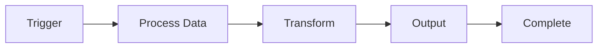

# n8n Workflow Template


A professional template for creating well-documented n8n workflow repositories. This template provides everything you need to share your n8n workflows with the community, including automated documentation, visual diagrams, and contributor-friendly guidelines.

## Overview

This workflow does [describe what your workflow does here]. It connects [list services/integrations] to [explain the outcome or value].

### Workflow Diagram



Replace the diagram above with your actual workflow visualization. Mermaid diagrams render automatically on GitHub and the documentation site.

## Quick Start

### Prerequisites

- n8n instance (version 1.0 or higher)
- [List any required credentials or API keys]
- [List any third-party service accounts needed]

### Installation

1. Download the workflow file from this repository:
   ```bash
   wget https://raw.githubusercontent.com/[username]/[repo-name]/main/workflow/workflow.json
   ```

2. Import into n8n:
   - Open your n8n instance
   - Navigate to **Workflows** → **Import from File**
   - Select the downloaded `workflow.json`
   - Click **Import**

3. Configure credentials:
   - [Step-by-step credential setup]
   - [Environment variables needed]
   - [Any API keys or tokens]

4. Activate the workflow and test it.

## Configuration

### Environment Variables

If your workflow uses environment variables, document them here:

```bash
# Example configuration
VARIABLE_NAME=value
API_KEY=your-api-key-here
```

### Workflow Settings

- **Trigger**: [Describe trigger type - webhook, schedule, manual, etc.]
- **Execution**: [Single execution, queue mode, etc.]
- **Error handling**: [How errors are handled]
- **Timeout**: [If applicable]

## Usage

### Basic Usage

Explain how to use the workflow once it's set up:

1. [First step]
2. [Second step]
3. [Expected output]

### Advanced Usage

[Optional: Document advanced features, customization options, or tips]

## Documentation

Full documentation is available on the [project website](https://[username].github.io/[repo-name]/).

For detailed setup instructions, see [docs/setup-guide.md](docs/setup-guide.md).

## Contributing

Contributions are welcome and encouraged! Whether you're fixing bugs, adding features, or improving documentation, your help makes this workflow better for everyone.

See [CONTRIBUTING.md](CONTRIBUTING.md) for guidelines on how to:
- Report issues
- Submit pull requests
- Suggest improvements
- Test workflow changes

All contributors will be recognized in the project.

## Architecture

[Optional: Explain the workflow architecture, node structure, or design decisions]

### Key Components

- **[Component 1]**: [Description]
- **[Component 2]**: [Description]
- **[Component 3]**: [Description]

## Troubleshooting

### Common Issues

**Issue: [Common problem]**
- Solution: [How to fix it]

**Issue: [Another problem]**
- Solution: [How to fix it]

See [docs/setup-guide.md](docs/setup-guide.md) for more troubleshooting help.

## Changelog

See [Releases](https://github.com/[username]/[repo-name]/releases) for version history and updates.

## License

This project is licensed under the MIT License - see the [LICENSE](LICENSE) file for details.

## Acknowledgments

- Built with [n8n](https://n8n.io)
- [Any other tools or services used]
- [Credits to contributors or inspirations]

## Support

- **Issues**: [GitHub Issues](https://github.com/[username]/[repo-name]/issues)
- **Discussions**: [GitHub Discussions](https://github.com/[username]/[repo-name]/discussions)
- **Documentation**: [Project Website](https://[username].github.io/[repo-name]/)

---

**Note**: Replace all placeholders in brackets with your actual workflow information. Update the Mermaid diagram to match your workflow structure.
